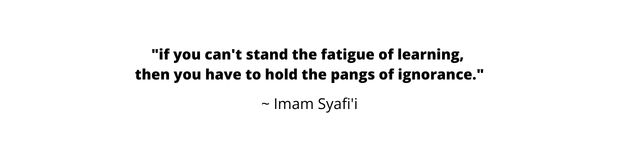

### **Hey I'm Raj Alam** 

Reach me out 📫  :

 

  

Hi, I'm <a href="https://rajalam.vercel.app">Raj Alam</a>, a Fullstack Web Developer 🚀 from Indonesia, currently, I'm a college student from Institut Teknologi Indonesia.

---

☄️ **Languages and Tools:**

---

**🎵 Spotify Playing:**
 

<!-- 

<b>My Codewars Stats 📈:</b>

 

 -->

 

<b>Quotes 📜 :</b>

 

